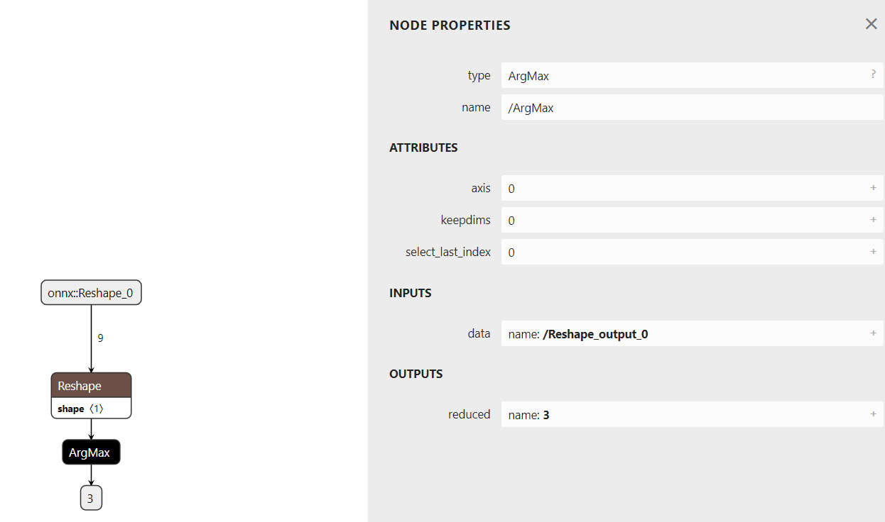
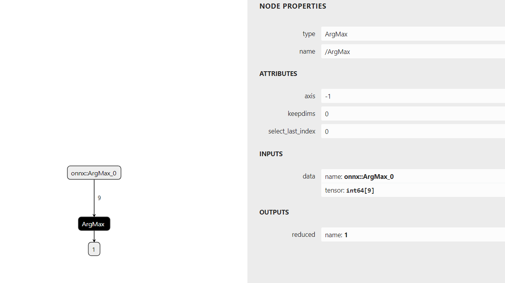
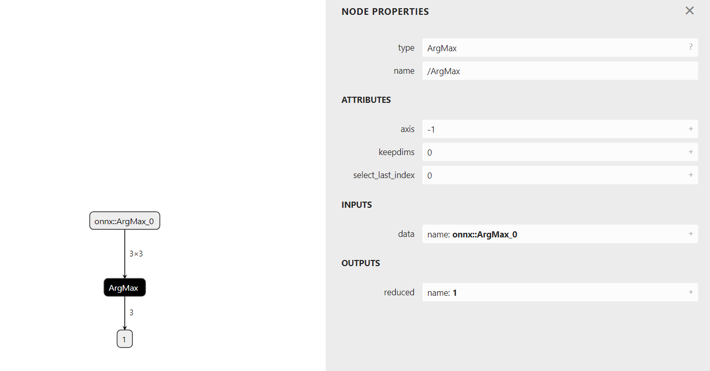

# torch2onnx
查看argmax算子，torch和onnx两个框架差异

## 2、construction_torch_model2onnx.py

### 1、torch的argmax，dim参数为None的时候，转换成onnx时会默认先加一个reshape展平成1维，在计算argmax

### 2、dim是-1的情况，输入是1维的

### 3、dim是-1的情况，输入是2维的
